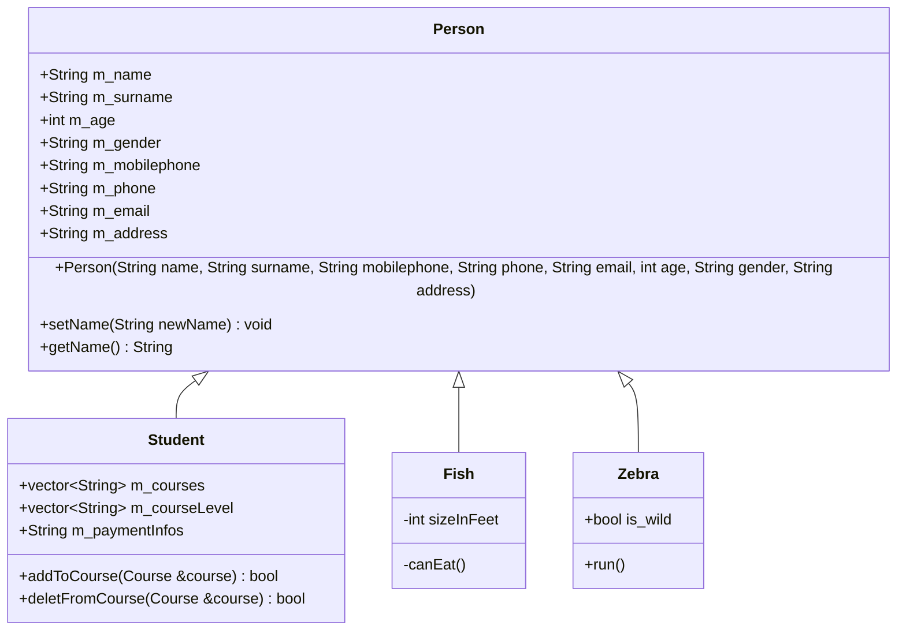

```mermaid
classDiagram
    Person <|-- Student
    Person <|-- Fish
    Person <|-- Zebra
    Person : +String m_name
    Person : +String m_surname
    Person : +int m_age
    Person : +String m_gender
    Person : +String m_mobilephone
    Person : +String m_phone
    Person : +String m_email
    Person : +String m_address
    Person: +Person(String name, String surname, String mobilephone, String phone, String email, int age, String gender, String address)
    Person: +setName(String newName) void
    Person: +getName() String
    class Student{
      +vector~String~ m_courses
      +vector~String~ m_courseLevel
      +String m_paymentInfos
      +addToCourse(Course &course) bool
      +deletFromCourse(Course &course) bool
    }
    class Fish{
      -int sizeInFeet
      -canEat()
    }
    class Zebra{
      +bool is_wild
      +run()
    }
            
```

