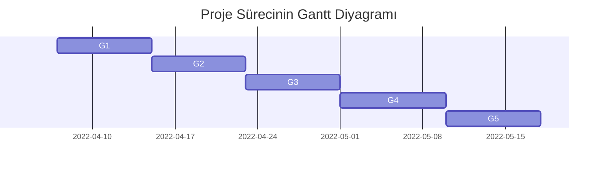

```mermaid
gantt
    title Proje Sürecinin Gantt Diyagramı
    dateFormat  YYYY-MM-DD
    G1           : a1, 2022-04-07, 8d
    G2           : a2, after a1, 8d
    G3           : a3, after a2, 8d
    G4           : a4, after a3, 9d
    G5           : a5, after a4, 8d
```

G1: Proje planının çıkarılması  
G2: İsteklerin modellenmesi  
G3: Nesneye dayalı modelleme  
G4: Nesneye dayalı tasarım  
G5: Birim testi sınamaları  