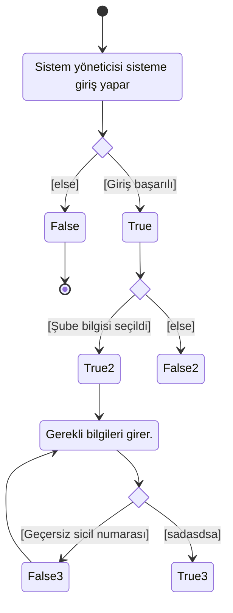

```mermaid
stateDiagram-v2
      State1: Sistem yöneticisi sisteme giriş yapar
      [*] --> State1
state if_state <<choice>>   
      State1 --> if_state     
      if_state --> True: [Giriş başarılı]
      if_state --> False: [else] 
      False --> [*]
state if_state2 <<choice>>
      True --> if_state2
      if_state2 --> True2: [Şube bilgisi seçildi]
      State3: Gerekli bilgileri girer.
      True2 --> State3
      state if_state3 <<choice>>
        State3 -->if_state3
        False3: 
        if_state3 --> False3: [Geçersiz sicil numarası]
        False3 --> State3
        if_state3 --> True3: [sadasdsa]
      if_state2 --> False2: [else] 

     
```
      
