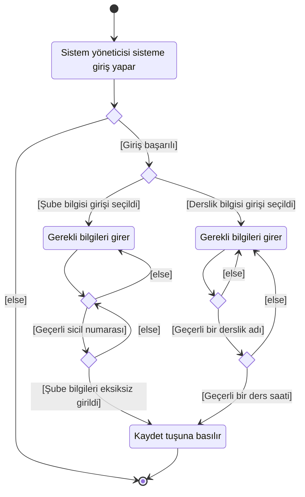

```mermaid
stateDiagram-v2
      State1: Sistem yöneticisi sisteme giriş yapar
      [*] --> State1
state if_state <<choice>>   
      State1 --> if_state
      state if_state2 <<choice>>
      if_state --> if_state2: [Giriş başarılı] 
      if_state -->  [*]: [else]
    state if_state2 <<choice>>
        State3: Gerekli bilgileri girer
        if_state2 --> State3: [Şube bilgisi girişi seçildi]
        state if_state3 <<choice>>
            State3 -->if_state3
            state if_state4 <<choice>>
            if_state3 --> if_state4: [Geçerli sicil numarası]
            if_state3 --> State3: [else]
            if_state4 --> State6: [Şube bilgileri eksiksiz girildi]
            if_state4 --> if_state3: [else]
        if_state2 --> State5: [Derslik bilgisi girişi seçildi] 
        State5: Gerekli bilgileri girer
            state if_state5 <<choice>>
            State5--> if_state5
            state if_state6 <<choice>>
            if_state5 --> if_state6: [Geçerli bir derslik adı]
            if_state5 --> State5: [else]
            if_state6 --> State5: [else]
            if_state6 --> State6: [Geçerli bir ders saati]
            State6: Kaydet tuşuna basılır
            State6 --> [*]
```
      
