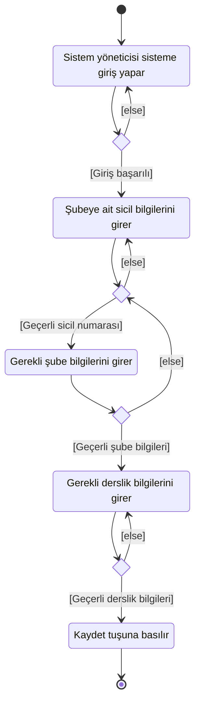

```mermaid
stateDiagram-v2
      State1: Sistem yöneticisi sisteme giriş yapar
      [*] --> State1
state if_state1 <<choice>>   
      State1 --> if_state1
      state if_state2 <<choice>>
      if_state1 --> State2: [Giriş başarılı] 
      if_state1 -->State1: [else]
        State2: Şubeye ait sicil bilgilerini girer
        state if_state2 <<choice>>
            State2 -->if_state2
            state if_state3 <<choice>>
            if_state2 --> State3: [Geçerli sicil numarası]
            State3: Gerekli şube bilgilerini girer
            State3 --> if_state3
            if_state2 --> State2: [else]
            if_state3 --> State4: [Geçerli şube bilgileri]
            if_state3 --> if_state2: [else]
        State4: Gerekli derslik bilgilerini girer
            state if_state4 <<choice>>
            State4--> if_state4
            if_state4 --> State6: [Geçerli derslik bilgileri]
            if_state4 --> State4: [else]
            State6: Kaydet tuşuna basılır
            State6 --> [*]
```
      
