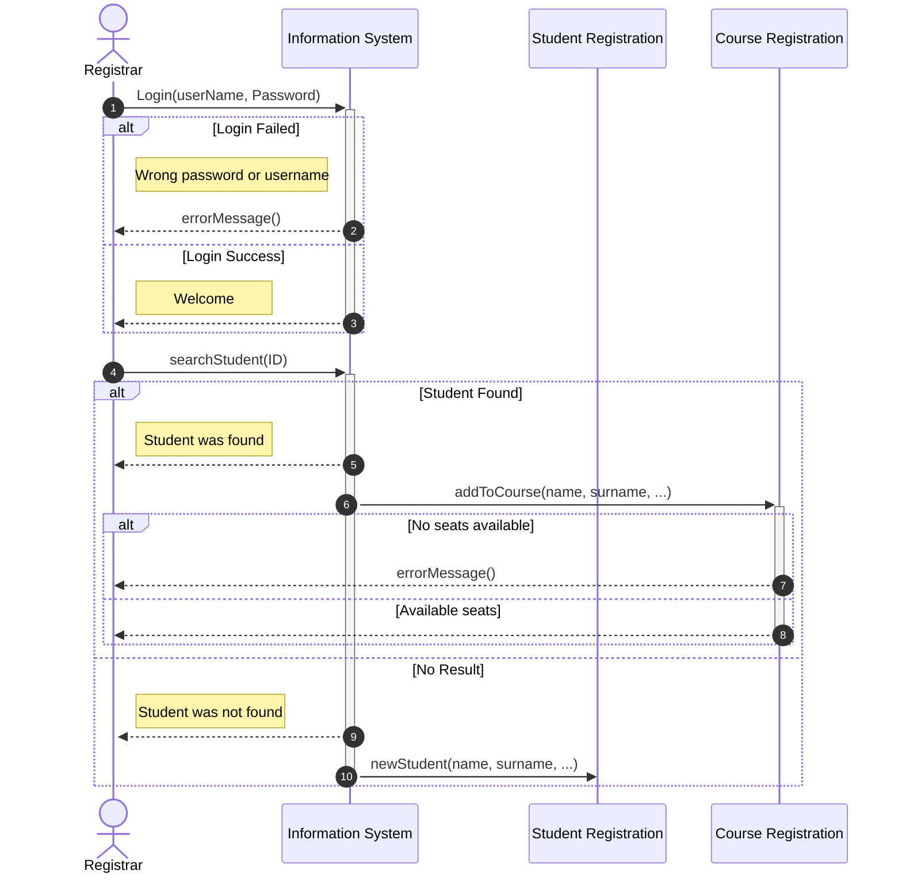

```mermaid
sequenceDiagram
    autonumber
    actor Registrar
    participant Information System
    participant Student Registration
    participant Course Registration

    Registrar->>+Information System: Login(userName, Password)
    alt Login Failed
        Note right of Registrar: Wrong password or username
        Information System-->>Registrar: errorMessage()
    else Login Success
        Note right of Registrar: Welcome
        Information System-->>-Registrar: 
    end

    Registrar->>+Information System: searchStudent(ID)
    alt Student Found
        Note right of Registrar: Student was found
        Information System-->>Registrar: 
        Information System->>+Course Registration: addToCourse(name, surname, ...)
        alt No seats available
        Course Registration-->>Registrar: errorMessage()
        else Available seats
        Course Registration-->>-Registrar: 
        end
    else No Result
        Note right of Registrar: Student was not found 
        Information System-->>+Registrar:       
        Information System->>-Student Registration: newStudent(name, surname, ...)
    end

    

  
```
