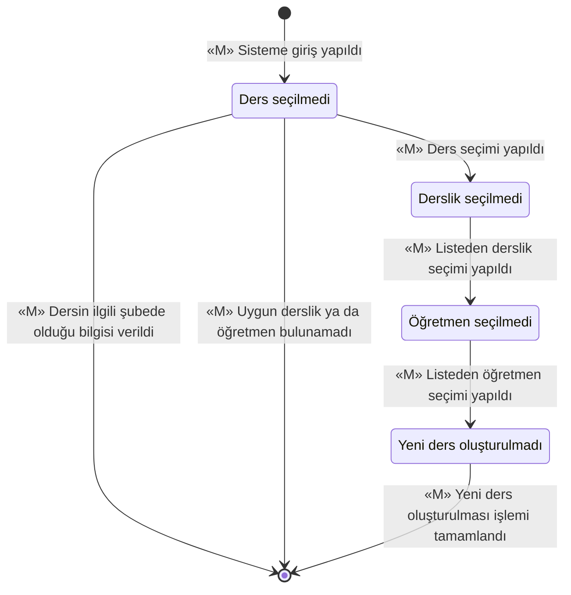

```mermaid
stateDiagram-v2
    State1: Ders seçilmedi
    [*] --> State1: &laquoM&raquo Sisteme giriş yapıldı
    State1 --> State2: &laquoM&raquo Ders seçimi yapıldı 
    State1 --> [*]: &laquoM&raquo Dersin ilgili şubede olduğu bilgisi verildi
    State2: Derslik seçilmedi
    State2 --> State3: &laquoM&raquo Listeden derslik seçimi yapıldı
    State1 --> [*]: &laquoM&raquo Uygun derslik ya da öğretmen bulunamadı
    State3: Öğretmen seçilmedi
    State5: Yeni ders oluşturulmadı
    State3 --> State5:  &laquoM&raquo Listeden öğretmen seçimi yapıldı
    State5 --> [*]: &laquoM&raquo Yeni ders oluşturulması işlemi tamamlandı
```
